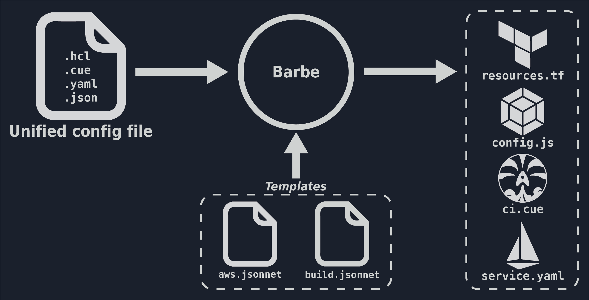
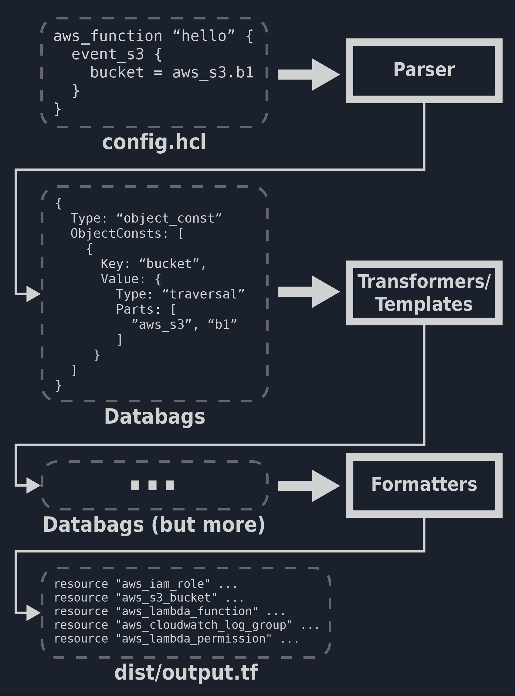

# Barbe 🧔

It takes more than 100 lines of terraform to configure autoscaling on a DynamoDB.
It takes 22 intricately connected resources to run a container image on AWS Fargate.

Barbe turns both of these into 6 lines. Simple to read, simple to write, as it should be.
```hcl
aws_dynamodb "my-table" {
  auto_scaling {
     min = 10
     max = 100
  }
}

aws_fargate_task "long-running-task" {
   docker {
      entrypoint = "./handler"
      runtime = "go"
   }
}
```

As developers, we care about concepts, ideas, like "serverless functions", "javascript bundling", "static website hosting".
Each vendor has their own way of implementing these concepts, and I don't want to learn 5 GCP services just to "deploy my Next.js front end".
Barbe does the heavy lifting of translating these concepts into vendor specific resources, so you can write `nextjs_hosting` instead of `google_cloud_run_service`, `google_container_registry` and 12 others.

Interested? Need some help? Reach out on [Discord](https://discord.gg/6Cwa6A8nF8)!

Projects using Barbe:
- [Barbe-serverless](https://github.com/Plenituz/barbe-serverless): Deploy serverless applications to AWS
- [Anyfront](https://github.com/Plenituz/anyfront): Deploy any front-end web application on any cloud platform with minimal configuration

### But it's more than that

Barbe is like the app store for configuration files. The docker hub for computer science concept implementations. 
You can publish your own definition of `nextjs_hosting`, or use ready-made definitions from the community.
For any concept you can imagine.

These definitions are written into components (think of it as a template) that generate all the files needed to achieve what you asked for. Barbe also uses [Buildkit](https://github.com/moby/buildkit) to run your deployment commands securely in containers, and making your deployment portable.

<p align="center">
  
</p>

This approach has lot of advantages:
- Drastically reduce boilerplate of any toolchain
- Use a toolchain's best practices by default, forever
- Reduce cost of changing tooling and cloud platforms
- Easily glue together internal and public toolchains
- Gracefully handle deprecation of tooling features

> Barbe is in pretty early stage, be on the lookout for breaking changes, and come have fun with it!

## But what is it concretely?

Concretely, Barbe is a _programmable syntax manipulation engine_

It parses your configuration file as generic "syntax tokens", gives those syntax tokens to a number of components that you chose, 
each one can manipulate and create more syntax tokens, Barbe then formats the result into files.

You specify the components you want using a simple URL, kind of like a `FROM` statement in a Dockerfile.
This allows your configuration file to stay simple, but still harness a world a complexity that the component developers prepared for you.

Components can also manipulate the syntax tokens it receives using dark magic, a simple reference like `cloudformation("my-stack").output.MyBucketName` in your Terraform file can be turned
into a concrete value gotten from your Cloudformation stack, without you lifting a finger.

#### An imaginary example project

Often when building cloud native applications, we have to glue together several toolchains, 
each of which can have its own configuration file, leading to having a number of files that depend on each other and 
potentially a lot of copy-pasting to do.

Let's imagine a project where we need:
 - A Terraform template with an AWS lambda function and all it's friends (logs, role, packaging, etc)
 - A JSON configuration file that our homemade service mesh reads to register the lambda function under an endpoint name `"action.do-something"`
 - A Webpack configuration to bundle our front end code

The config file below contains enough information for Barbe to generate all these files
```hcl
# config.hcl
template {
  # these are the links to the manifests that contain the components
  manifest = [
    # We can start from some open source manifest for the cloud resources
    "https://hub.barbe.app/barbe-serverless/manifest/latest/.json",
    # then you can add your own sprinkles, this would link to
    # the components that generates your custom service mesh configs
    "https://mycompany.com/custom-service-mesh-stuff.json"
  ]
}

# all of the properties of each block below are defined 
# and documented by the creators of the components imported above
serverless_function "something-doer" {
    package_include = ["bin/something_doer"]
    service_mesh_endpoint = "action.do-something"
}

javascript_bundler "webpack" {
  typescript    = true
  static_assets = "./public/*"
  entry    = "src/App.tsx"
}
```

The manifests and components defined in the `template` block abstract away the implementation details of using terraform with AWS, the format of our service mesh file, and the webpack.config.js. 

Also note how 2 completely separate components (`custom-service-mesh-stuff` and `barbe-serverless`) can pull from the same 
`serverless_function` block without stepping on each other's toes. 
This is one of the powerful aspect of Barbe allowing you to enhance your configuration file as the project evolves.

Of course sometimes you will want/have to use the configuration file for a specific tool directly (like the webpack config for example).
Components can easily be designed to allow you to override parts of the generated configuration file, or even completely replace it.

> Note: In this example the Barbe config file is in [HCL](https://github.com/hashicorp/hcl), but Barbe is language agnostic

## How does it work?

To run barbe, you use the `apply` command: 
```bash
barbe apply config.hcl
```

This will:

1. Parse the input file(s) `config.hcl` into an internal language agnostic syntax representation, "Databags" (basically collections of syntax tokens, an AST)
2. Download the manifests defined in the `template` block, and the list of components in the manifest. Components are **_sandboxed_** using WASM.
3. Execute each component giving it the parsed syntax tokens from step 1 as an input. Each component will generate additional syntax tokens
4. While executing, components can use `buildkit` to execute containers of all sorts. This lets the component developer use any tooling without you having to install it, and keep everything sandboxed.
5. The syntax tokens will then be interpreted by various formatters which will generate the output files in the given "dist" directory (terraform files, service mesh configs, webpack.config.js, Dockerfiles, etc)
6. More components can then run to execute actions on the generated files (`terraform apply`, `docker push`, etc)

<p align="center">
  
</p>

## Writing components

If you're planning on writing components (or are just curious) you can take a look at the [Writing Components page](./docs/writing-components.md) or [documentation](./docs/README.md)

You can also explore existing components on the [Barbe-serverless](https://github.com/Plenituz/barbe-serverless) and [Anyfront](https://github.com/Plenituz/anyfront) repository